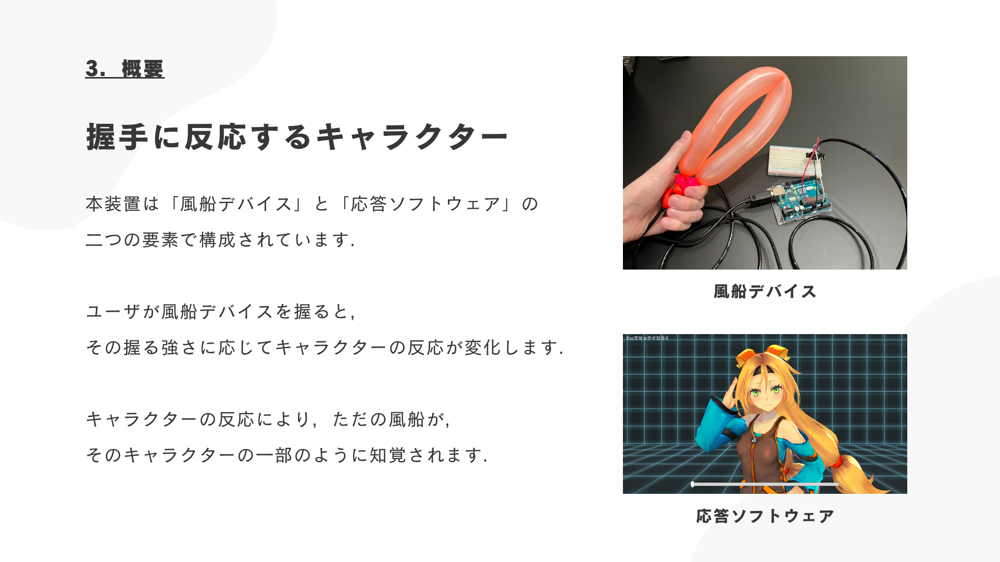

# 握手に反応するキャラクター

大学の授業の一環で，「心をうごかす」というテーマに沿って考案・制作したものです．

人が握手をすると，反応するキャラクターとなっています．

## 発表スライド

https://github.com/N-Keisho/ReactionToHandshake/assets/133760530/9d92d3ab-d97c-42ac-9e9f-fd06c9afe265

